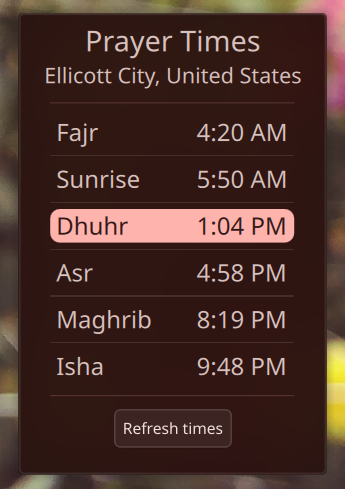
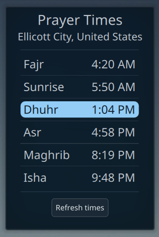

# Prayer Times
## A simple prayer times widget for KDE Plasma 6

This is a simple prayer times widget for KDE Plasma 6. The API call code is from Fahim Shahriar's AdhanTimes. The project is forked from Marco Martin's analogclock for the basic widget functionality. The API used to get prayer times is from here https://aladhan.com/prayer-times-api. Feel free to copy the project and make your own widget!

## Contributors
Special thanks to @ammar-elmesaly and @MrGueest for their work on the project
